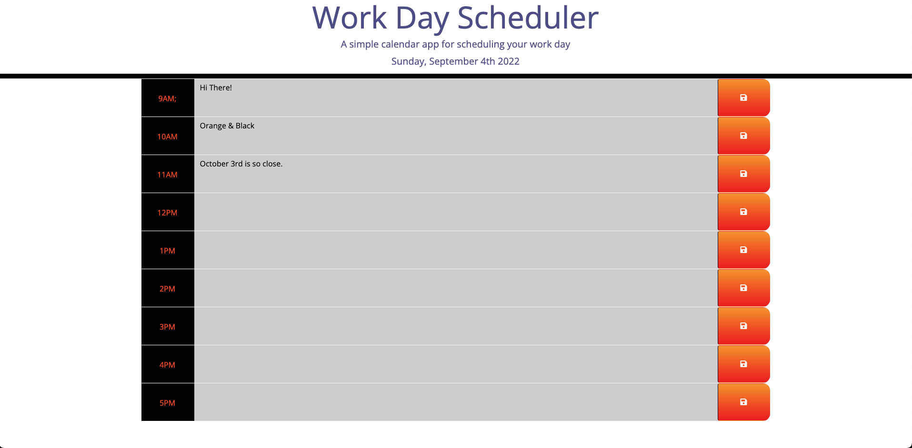

# Work-Day-Scheduler
[](https://github.com/Chasek6/Work-Day-Scheduler)
## Description
A simple work day scheduler application for keeping track of hourly appointment & Todo's.


# ScreenShots



## Table of Contents 
- [Work-Day-Scheduler](#work-day-scheduler)
  - [Description](#description)
- [ScreenShots](#screenshots)
  - [Table of Contents](#table-of-contents)
  - [Installation](#installation)
  - [Usage](#usage)
  - [License](#license)
  - [Contributing](#contributing)
  - [Tests](#tests)
  - [Questions](#questions)
## Installation
To install necessary dependencies, run the following command:
```
However you like
```
## Usage

## License
This project is licensed under the MIT license.
  
## Contributing
Chase Stratton 
## Tests
To run tests, run the following command:
```
npm test
```
## Questions
If you have any questions about the repo, open an issue or contact [Chasek6](undefined) directly at quranstratton@gmail.com.
